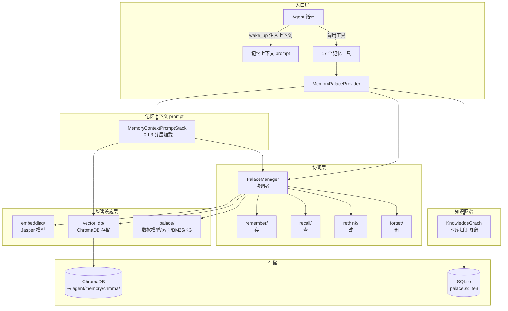
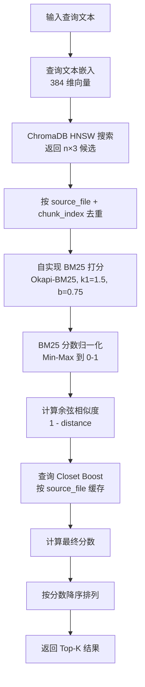
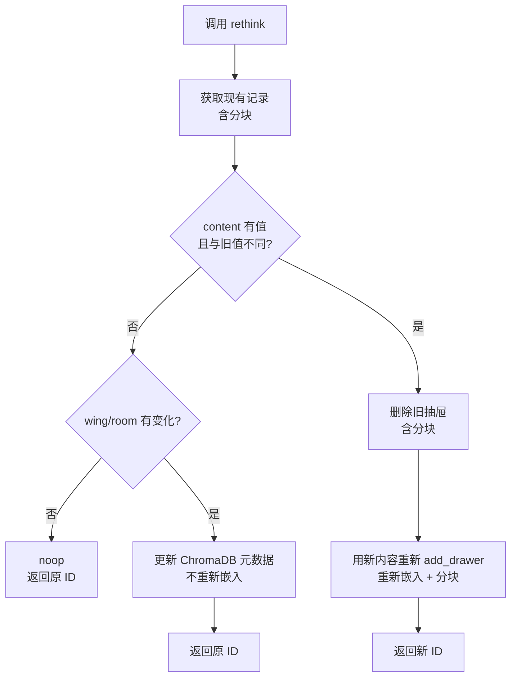
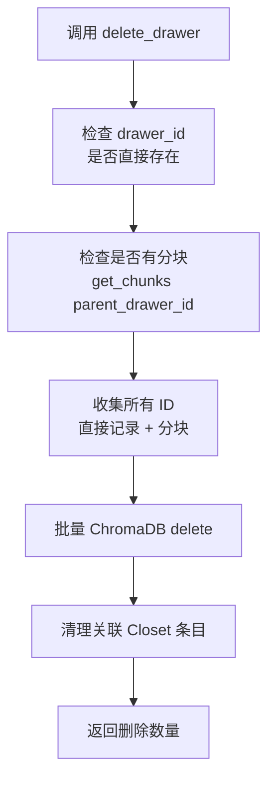
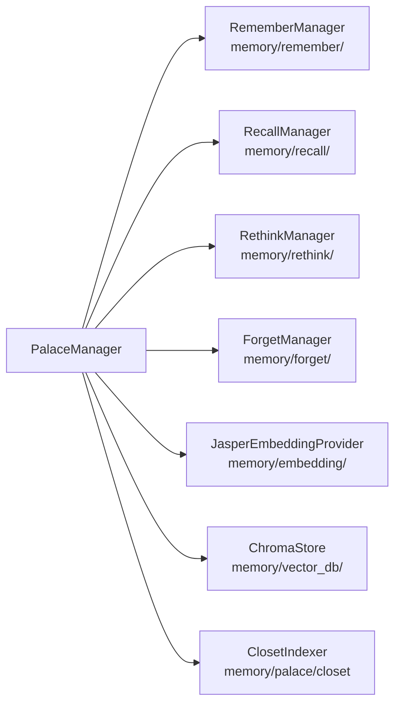
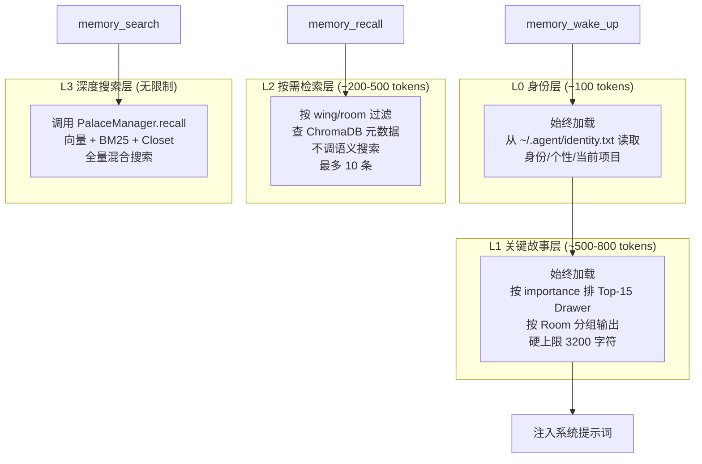
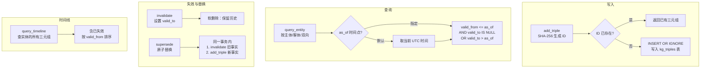
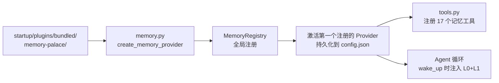

# 记忆机制（Memory Palace）实现说明

## 一、核心理念：宫殿隐喻

整个记忆系统叫 **Memory Palace（记忆宫殿）**，用一个空间隐喻来组织记忆：

```
Palace（宫殿）
  └── Wing（翼：顶层命名空间，比如项目名、人名、领域）
        └── Room（房间：某个 Wing 下的子分类/主题）
              └── Drawer（抽屉：最小存储单元，~800 字符的文本片段）
                    └── Closet（壁橱：指向 Drawer 的二级搜索索引）
```

- **Drawer（抽屉）** 是最小的记忆单元，存放一段文本
- **Closet（壁橱）** 是加速搜索用的倒排索引，提取话题、实体、时间线
- **Wing/Room** 是元数据标签，用于粗粒度过滤和导航
- 同时还有一个独立的 **知识图谱（Knowledge Graph）** 存储实体之间的时序关系

---

## 二、整体架构流程图



### 目录结构

```
memory/
  ├── __init__.py               # 顶层导出
  ├── embedding/                 # Jasper embedding 模型和代码
  │   ├── __init__.py            # 导入和导出
  │   ├── provider.py            # JasperEmbeddingProvider 类
  │   └── download.py            # 模型下载脚本（git clone + hf-mirror.com）
  ├── vector_db/                 # 向量数据库存储层
  │   ├── __init__.py            # 导入和导出
  │   └── store.py               # ChromaStore 类（ChromaDB PersistentClient）
  ├── palace/                    # Palace 特性（数据模型、索引、基础设施）
  │   ├── __init__.py            # 导入和导出
  │   ├── manager.py             # PalaceManager 协调者
  │   ├── models.py              # Drawer, ClosetEntry, KGTriple 数据模型
  │   ├── closet.py              # ClosetIndexer 索引器
  │   ├── sanitize.py            # 文本清理
  │   ├── ids.py                 # ID 生成、内容哈希
  │   ├── collision_scan.py      # 碰撞检测
  │   ├── bm25.py                # Okapi-BM25 算法
  │   └── knowledge_graph.py     # KnowledgeGraph 时序知识图谱
  ├── sqlite_store/              # SQLite 存储后端（仅 KG 使用）
  │   ├── __init__.py            # 导入和导出
  │   └── store.py               # PalaceStorage 类
  ├── memory_context_prompt/     # 记忆上下文 prompt 模块
  │   ├── __init__.py            # 导入和导出
  │   ├── layer0.py              # L0 身份层（读 identity.txt）
  │   ├── layer1.py              # L1 关键故事层（ChromaStore）
  │   ├── layer2.py              # L2 按需检索层（ChromaStore）
  │   ├── layer3.py              # L3 深度搜索层（PalaceManager.recall）
  │   └── stack.py               # MemoryContextPromptStack 四层统一接口
  ├── remember/                  # 存类
  │   ├── __init__.py            # 导入和导出
  │   └── manager.py             # RememberManager（add_drawer, add_drawers）
  ├── recall/                    # 查类
  │   ├── __init__.py            # 导入和导出
  │   └── manager.py             # RecallManager（recall, get_drawer, list_wings, ...）
  ├── rethink/                   # 改类
  │   ├── __init__.py            # 导入和导出
  │   └── manager.py             # RethinkManager（rethink）
  ├── forget/                    # 删类
  │   ├── __init__.py            # 导入和导出
  │   └── manager.py             # ForgetManager（delete_drawer, delete_by_source）
  └── plugin/                    # 插件接入层
      ├── __init__.py            # 包标记
      ├── provider.py            # MemoryPalaceProvider 协议适配层
      └── tools.py                # 17 个 Agent 工具

startup/plugins/bundled/memory-palace/
  ├── .agent-plugin/
  │   └── plugin.json             # 插件清单
  └── memory.py                  # 插件入口（create_memory_provider）
```

---

## 三、数据模型

### 3.1 Drawer（抽屉）-- 最小记忆单元

| 字段 | 类型 | 说明 |
|------|------|------|
| `id` | str | 唯一 ID，SHA-256(`wing\|room\|content`) 前 16 位 |
| `wing` | str | 顶层命名空间 |
| `room` | str | 子分类 |
| `content` | str | 文本内容（~800 字符） |
| `source_file` | str | 来源文件路径 |
| `filed_at` | str | 入库时间（ISO 8601） |
| `authored_at` | str | 原始创建时间 |
| `chunk_index` | int | 分块序号 |
| `importance` | float | 重要性 0.0-1.0 |
| `source_mtime` | float | 来源文件修改时间（增量判断用） |
| `content_hash` | str | 内容 SHA-256（去重用） |
| `parent_drawer_id` | str | 父抽屉 ID（分块关联，空字符串=非分块） |

### 3.2 ClosetEntry（壁橱）-- 二级搜索索引

| 字段 | 类型 | 说明 |
|------|------|------|
| `id` | str | 唯一 ID |
| `source_hash` | str | 来源文件路径的哈希 |
| `topic` | str | 话题关键词（分号分隔） |
| `entities` | str | 实体名（分号分隔） |
| `date_line` | str | 时间线 "YYYY-MM-DD:Lstart-Lend" |
| `drawer_ids` | str | 指向的 Drawer ID（逗号分隔） |

### 3.3 KGTriple（知识图谱三元组）

| 字段 | 类型 | 说明 |
|------|------|------|
| `id` | str | 唯一 ID，SHA-256(`subject\|predicate\|object`) |
| `subject` | str | 主体 |
| `predicate` | str | 关系类型（如 `works_on`, `child_of`） |
| `object` | str | 客体 |
| `valid_from` | str | 生效时间 |
| `valid_to` | str | 失效时间（NULL = 仍有效） |
| `confidence` | float | 置信度 0.0-1.0 |
| `drawer_refs` | str | 证据 Drawer ID |

---

## 四、Embedding 模型

默认使用 `infgrad/Jasper-Token-Compression-600M`（0.61B 参数，CPU 运行）。

| 指标 | 中文 C-MTEB | 英文 MTEB |
|------|:---:|:---:|
| 排名 | 9 | 2 |
| Mean | 73.55 | 74.75 |
| Retrieval | 75.63 | 66.19 |

### 关键设计

1. **下载方式**：通过 `git clone` 从 HuggingFace 下载，默认用 `hf-mirror.com` 镜像加速
2. **模型缓存位置**：缓存在项目内 `memory/embedding/jasper-model/` 目录（不使用 HF 默认的 `~/.cache/huggingface/`）
3. **安装时下载**：`init()` 时自动检查并下载，也可通过 CLI 命令 `download-embedding-model` 手动触发
4. **Matryoshka 截断**：Jasper 原始输出 2048 维，截断到前 384 维
5. **L2 归一化**：截断后做 L2 归一化，使余弦相似度 = 点积
6. **trust_remote_code**：Jasper 模型含自定义模块（custom_st.py），加载时需 `trust_remote_code=True`
7. **降级处理**：sentence-transformers 未安装或模型未下载时，降级为纯 BM25 模式，不阻断操作

---

## 五、存储架构

### 5.1 ChromaDB 向量存储（vector_db/）

抽屉的文档、向量、元数据存储在 ChromaDB 中，使用 HNSW 索引和 cosine 距离。

- 数据目录：`~/.agent/memory/chroma/`
- Collection 名称：`drawers`
- 距离度量：cosine
- 索引：HNSW（近似最近邻）

ChromaStore 提供的方法：

| 方法 | 说明 |
|------|------|
| `upsert_drawer` | 写入/更新单条抽屉（文档 + 向量 + 元数据） |
| `upsert_drawers` | 批量写入 |
| `query_drawers` | 向量搜索 + 元数据过滤 |
| `get_drawer` | 按 ID 获取 |
| `get_chunks` | 按 parent_drawer_id 获取所有分块 |
| `delete_drawer` / `delete_drawers` | 删除单条/批量 |
| `delete_by_source` | 按 source_file 删除 |
| `count` / `list_wings` / `list_rooms` | 元数据聚合查询 |

### 5.2 SQLite（知识图谱）

知识图谱三元组使用 SQLite 存储：
- 数据库：`~/.agent/memory/palace.sqlite3`
- KnowledgeGraph 类位于 `memory/palace/knowledge_graph.py`
- 依赖 `memory/sqlite_store/` 的 PalaceStorage 做 SQLite 操作

---

## 六、四类 CRUD 详解

### 6.1 remember 类（存）

`memory/remember/` 模块实现 `RememberManager`，包含 `add_drawer` 和 `add_drawers`。

```mermaid
flowchart TD
    START[调用 add_drawer] --> SAN[sanitize_content<br/>清理有害字符]
    SAN --> LEN{content > 800<br/>字符?}
    LEN -->|否| SINGLE[单块路径]
    LEN -->|是| CHUNK[分块路径]
    
    SINGLE --> GENID[生成 drawer_id<br/>SHA-256 wing|room|content]
    SINGLE --> IDEMP{已存在?}
    IDEMP -->|是| RETURN[返回已有对象]
    IDEMP -->|否| EMBED[Jasper 嵌入<br/>384 维向量]
    EMBED --> UPSERT[ChromaDB upsert]
    UPSERT --> CLOSET[构建 Closet 索引]
    CLOSET --> DONE[返回 Drawer]
    
    CHUNK --> SPLIT[按段落/行边界切分<br/>~800 chars/块, 100 字符重叠]
    SPLIT --> GENPARENT[生成父 ID<br/>SHA-256 wing|room|content前200字符]
    GENPARENT --> BATCHEMB[批量 Jasper 嵌入]
    BATCHEMB --> BATCHUP[批量 ChromaDB upsert<br/>原子操作]
    BATCHUP --> DONE2[返回父 Drawer]
```

**要点**：
- ID 基于内容哈希，天然幂等 -- 相同内容重复写入不会产生重复记录
- 分块逻辑内建在 add_drawer 中，不再依赖 FileMiner
- 每块 ID = `{parent_drawer_id}_chunk_{index}`，元数据标记 `parent_drawer_id`
- embedding 不可用时仍存储文档，向量传 None

### 6.2 recall 类（查）

`memory/recall/` 模块实现 `RecallManager`，包含语义搜索 `recall` 和元数据查询方法。



**最终分数公式**：

| 模式 | 公式 |
|------|------|
| 向量可用 | `0.6 × cosine_sim + 0.4 × bm25_norm + closet_boost` |
| 纯 BM25（降级） | `0.4 × bm25_norm + closet_boost` |

**故障降级**：ChromaDB 索引损坏或 embedding 不可用时，自动回退纯 BM25 搜索，搜索不中断。

其他查询方法：`get_drawer`、`get_drawers_by_source`、`list_wings`、`list_rooms`、`get_taxonomy`、`status`、`list_drawers_by_importance`。

### 6.3 rethink 类（改）

`memory/rethink/` 模块实现 `RethinkManager`，包含 `rethink` 方法。抽屉内容不可变，修改通过"删旧插新"或元数据更新完成。



**三条路径**：
- **noop**：content/wing/room 都未提供或与现有值相同 -> 直接返回原 ID
- **仅改元数据**：content 为 None，仅改 wing/room -> 更新 ChromaDB metadata，不重新嵌入
- **改内容**：content 不同 -> 删除旧抽屉（含分块）+ 用新内容重新 add_drawer

### 6.4 forget 类（删）

`memory/forget/` 模块实现 `ForgetManager`，包含 `delete_drawer`、`delete_by_source`、`delete_drawers`。增强分块删除支持。



---

## 七、PalaceManager 协调者

PalaceManager 位于 `memory/palace/manager.py`，不再直接实现 CRUD 逻辑，而是委托到四个独立模块：



PalaceManager 初始化时自动创建底层组件，并注入到四个 CRUD 管理器中。

---

## 八、四层记忆加载（L0-L3）

`memory/memory_context_prompt/` 文件夹实现记忆上下文 prompt 模块，每层有独立文件：



| 文件 | 类 | 说明 |
|------|-----|------|
| `layer0.py` | Layer0 | 身份层，读 `~/.agent/identity.txt`，不依赖存储 |
| `layer1.py` | Layer1 | 关键故事层，用 ChromaStore 获取 Top-15 抽屉 |
| `layer2.py` | Layer2 | 按需检索层，用 ChromaStore 按 wing/room 过滤 |
| `layer3.py` | Layer3 | 深度搜索层，用 PalaceManager.recall 做语义搜索 |
| `stack.py` | MemoryContextPromptStack | 四层统一接口，注入 ChromaStore 和 PalaceManager |

**加载规则**：
- 启动时自动加载 L0 + L1，注入到 Agent 系统提示词中
- L2 在需要按元数据定位时触发
- L3 在有明确搜索意图时触发

---

## 九、知识图谱（Knowledge Graph）

KnowledgeGraph 位于 `memory/palace/knowledge_graph.py`，基于 SQLite 存储时序三元组。

时序知识图谱的核心语义是 **[valid_from, valid_to)** 半开区间。



**主要操作**：

| 操作 | 说明 |
|------|------|
| `add_triple` | 添加事实，幂等 |
| `query_entity` | 查实体的关系（支持主体/客体/双向 + as_of 时间点） |
| `query_timeline` | 查实体的完整历史（含已失效事实） |
| `invalidate` | 标记旧事实失效（不物理删除） |
| `supersede` | 原子替换（关闭旧 + 打开新，同一时间边界） |

---

## 十、插件集成

记忆系统作为插件加载，符合 MemoryProvider 协议：



**MemoryProvider 协议接口**：

| 方法 | 说明 |
|------|------|
| `store(session_id, key, content)` | 存储一条记忆 |
| `retrieve(session_id, key)` | 检索一条记忆 |
| `search(query, limit)` | 搜索 |
| `clear(session_id)` | 清除会话记忆 |

**17 个 Agent 工具**：

| 工具名 | 类别 | 说明 |
|--------|------|------|
| `memory_search` | 查 | 按元数据过滤查找（Wing/Room/来源文件） |
| `memory_recall` | 查 | 语义搜索（向量 + BM25 混合） |
| `memory_rethink` | 改 | 修改抽屉内容或元数据 |
| `memory_add` | 存 | 添加记忆（remember 类） |
| `memory_wake_up` | 加载 | L0+L1 唤醒 |
| `memory_status` | 状态 | 查看 Palace 状态 |
| `memory_list_wings` | 导航 | 列出所有 Wing |
| `memory_list_rooms` | 导航 | 列出 Wing 下的 Room |
| `memory_get_drawer` | 读取 | 按 ID 获取 |
| `memory_get_by_source` | 读取 | 按源文件获取 |
| `memory_delete` | 删 | 按 ID 删除（forget 类，自动处理分块） |
| `memory_delete_by_source` | 删 | 按源文件删除 |
| `memory_kg_add` | 知识图谱 | 添加三元组 |
| `memory_kg_query` | 知识图谱 | 查询实体关系 |
| `memory_kg_timeline` | 知识图谱 | 查询实体时间线 |
| `memory_kg_invalidate` | 知识图谱 | 标记事实失效 |
| `memory_kg_supersede` | 知识图谱 | 原子替换事实 |

---

## 十一、关键设计决策

1. **四类 CRUD 独立文件夹**：remember / recall / rethink / forget 各自有独立文件夹，PalaceManager 作为协调者委托调用
2. **向量数据库独立**：ChromaDB 存储层在 `memory/vector_db/` 独立管理，HNSW + cosine 距离
3. **Jasper 默认 embedding**：`infgrad/Jasper-Token-Compression-600M`，Matryoshka 截断 384 维，模型缓存在项目内 `memory/embedding/jasper-model/` 目录
4. **模型安装时下载**：通过 `git clone` 从 HuggingFace 下载，默认用 `hf-mirror.com` 镜像加速，`init()` 时自动检查
5. **Palace 特性独立**：数据模型、Closet 索引、sanitize、ID 生成、BM25、知识图谱等基础设施在 `memory/palace/` 统一管理
6. **记忆上下文 prompt 独立**：L0-L3 各有独立文件，MemoryContextPromptStack 统一接口，注入 ChromaStore 和 PalaceManager
7. **抽屉不可变**：修改通过"删旧插新"完成，避免并发写冲突，保证可追溯
8. **ID 基于内容哈希**：天然防重，无需分布式 ID 生成
9. **分块内建**：add_drawer 在 content > 800 字符时自动分块
10. **时序知识图谱**：事实不删除只失效，支持"回到过去"查看历史状态
11. **混合搜索权重可调**：向量 0.6 + BM25 0.4，语义与关键词互补
12. **分层加载**：L0/L1 自动注入控制 token 消耗，L2/L3 按需触发避免浪费上下文窗口
13. **故障降级**：ChromaDB 不可用时回退纯 BM25，embedding 不可用时降级为纯关键词搜索
